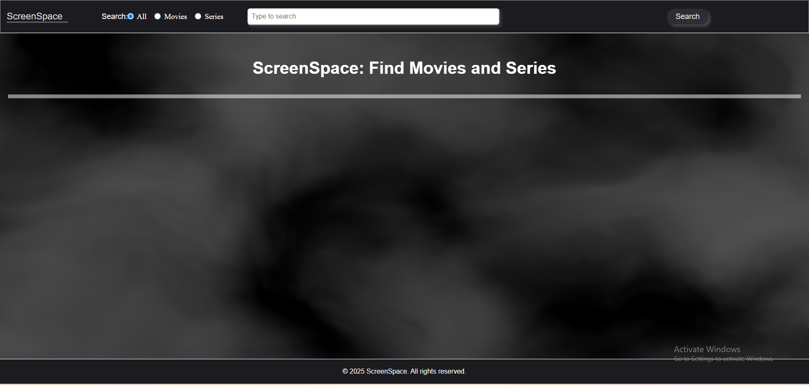
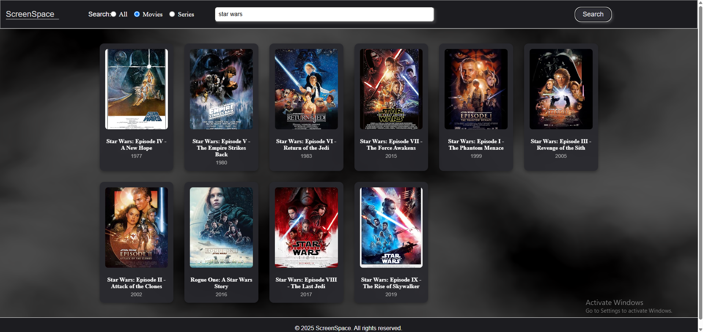
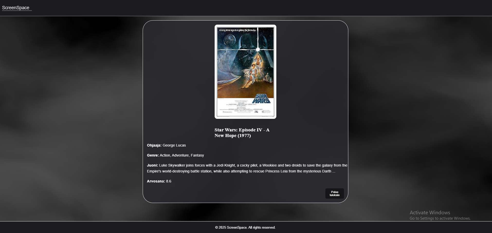

# Projekti 3: jQuery-MovieApp
Elokuvien ja sarjojen info sovellus / verkkosivu, joka on tehty jQueryllä.

Joachim Pehkonen, Joonas Sipilä

Verkkolinkit: Pääset julkaistuun sovellukseen käsiksi osoitteessa google.com Linkki projektin videoesittelyyn google.com

* Sovelluksen netlify linkki:
https://jquery-movieapp.netlify.app/

* Github linkki: 
https://github.com/Joonas770/jQuery-MovieApp

**Työn jakautuminen Miten työmäärä jaettiin? Kuka teki mitä? Miten yhteistyö sujui?**

Projektia tehtiin sovittuina aikoina, tehtävät jaettiin tasapuolisesti ja molemmat työstivät jaettujaa tehtäviä itsenäisesti ja tarvittaessa auttoivat toisia. Yhteistyö sujui erinomaisesti, eikä ollut ongelmia.

**Esimerkkejä tehdyistä tehtävistä**

Joonas: Sumutausta vanta.js, jQuery DOM-skriptausta, API-kutsuja, sivuston struktuuria sekä visuaalisuutta sekä sivuston suunnittelua.

Joachim: jQuery DOM-skriptausta, API-kutsuja, sivuston rakenteen ideointia, CSS-tiedoston tyylien määrittelyä. 

**Oma arvio työstä ja oman osaamisen kehittymisestä**

*Mielestäni onnistuin... Parantamista olisi... Sovelluksesta jäi puuttumaan... Koen, että olen oppinut... Epäselväksi jäi... Antaisin itselleni pisteitä seuraavasti: xx/yy p*

Joonaksen arvio ja kehittyminen: 

Mielestäni onnistuin projektin tekemisessä hyvin. Projekti alkoi tutkimalla aluksi JQuery sekä muita javascript kirjastoja ja näiden toimivuutta. Tämän jälkeen ruvettiin tekemään sivuston struktuuria ja visuaalisuutta. Käytimme Vanta.js sumutausta efektiä ja tässä onnistuin mielestäni hyvin, mutta tässä ilmeni myös ongelma ei meinattu saamaan tätä venymään leveys että korkeus suuntaan lopulta saimme tämän onnistumaan. Olen tyytyväinen miltä projekti näyttää visuaalisesti ja toimivuudeltaan. Opin mielestäni lisää taas API kutsuista ja uutena JQuery toimivuudesta sekä tämän hyödyistä. JQuery käyttö vielä vaati kehitystä, mutta huomaan selkeästi tämän nopeuttavan Web sovellusten tekoa.

Projektin parantaminen: Lisää toimminalisuuksia sekä saisi enemmän elokuvia/sarjoja näytölle, mutta tähän ei voida vaikuttaa koska pystyi maksimissaan samaan 10 eri elokuvan tai sarjan tiedot ulos kerralla.

Opin: JQuery käyttöä ja sen toiminalisuuksia. Käyttämään API-kutsuja paremmin sekä lisää javascriptistä.

Arvosanaksi antaisin: Antaisin projektille 9-10 pistettä. Projektissa hyödynsimme mielestäni hyvin JQuery:ä ja datan hakeminen on helpompaa kuin aikaisemmassa projektissa ja käytimme toista Javascript kirjastoa visuaalisuuteen. Yleinen visuaalisuus on kiva ja toimiva.

Linkki Joonaksen video esittelyyn:
https://www.youtube.com/watch?v=fNcZnT2WzMM

Joachimin arvio ja kehittyminen:

Projekti sujui hyvin ja molemmat työstivät sitä yhteisillä kokoontumiskerroilla. Joonas ehti aloittaa ensiksi sivun rakenteen kanssa ja molemmat sitten työstivät projektia samaan aikaan Visual Studio Coden Live Share -toiminnon avulla. Työstimme molemmat aikalailla samoja kohtia, koska käytännössä meidän piti saada vain "all" suodatin toimimaan, jonka jälkeen sitä piti vain vähän hienosäätää leffa ja sarja osioita, jotta molempien API-linkit hakivat tyypit: series ja movies, tällä saatiin nopeasti perusidea ja oikeat tiedot kaikille suodattimille tehtyä.

Sovelluksesta ei varsinaisesti jäänyt uupumaan mitään konkreettista, halusimme, että tämä eroaisi hieman projekti 2:ta, joten pyrimme keskittymään enemmän jQuery DOM-skriptaukseen ja siihen, että sivuston toiminnallisuus olisi kunnossa sekä visuaalisesti miellyttävä. Toki olisi lisätietoihin olisi voinut sisällyttää enemmän tietoa, kuten meillä oli projekti 2:ssa.

Onnistuin mielestäni jQuery DOM-skriptauksessa ja API-kutsuissa. Opin ohjelmoimaan jQuery DOM-skriptauksella ja kehittämään API-kutsuja

Parantamista olisi varmaan sen kanssa, että API saisi useamman tuloksen sivulle, mutta tyydyimme nyt tähän max 10 tuloksen lopputulemaan. 

Kaiketi tästä voisi myös 9-10 antaa, kun aikalailla kaikki vaadittu on saatu sivulle. Toki on noita pieniä juttuja, mitä olisi voinut muokata, kuten ulkonäkö ja toiminnot olisi voineet olla hieman parempia, jäi itseäni hieman mietityttämään, että kuinka paljon tuo VANTA.js sumutausta vaikuttaa loppupeleissä nettisivun suorituskykyyn/nopeuteen, mutta muuten olen varsin tyytyväinen lopputulokseen.

Linkki Joachimin video esittelyyn:

https://www.youtube.com/watch?v=xVFO_qv0otA 

**Molempien työtunnit:**
Työstimme projektia n. ~16, pyrimme tekemään projektia päivittäin 2-4 tuntia.

**Palaute opettajalle kurssista sekä itse opetuksesta tähän saakka**

Palautteemme on, että kurssi on ollut hyvin tehty ja oppimminen on ollut helppoa kurssimateriaalien avulla. Opettajalta on saanut helposti apua tarvittaessa ja kurssin aihealueet on selitetty selkeästi. Lähiopetus tunnit ovat olleet hyviä oppimisen kannalta.

**Sisällysluettelo:**

Tietoja sovelluksesta 
Tunnetut virheet/bugit 
Kuvakaappaukset 
Teknologiat 
Asennus 
Kiitokset ja lähteet 
Lisenssi

**Tietoja sovelluksesta**

Leffa/sarja ohjelma antaa käyttäjän hakea elokuvia tai sarjoja, jonka jälkeen käyttäjä saa tietää "perustiedot" kyseisestä sarjasta tai elokuvasta,  juoni, ohjaaja, kesto jne... Käyttäjä voi hakea eri elokuvia tai sarjoja jolloinka vanhat hakutulokset katoavat. Lisäksi käyttäja voi suodattaa leffojen, sarjojen tai kaiken mahdollisen digitaalisenmedian, kuten pelien kautta väliltä. Pääidea kuitenkin on se, että käyttäjä hakee leffoja sekä sarjoja ohjelmallamme.

**Tunnetut virheet/bugit**

Jotkut julisteet ei saata näkyä, koska niitä ei löydy OMDB API:sta, mutta muuten ohjelman pitäisi toimia normaalisti. OMDB API antaa myös vain 10 tulosta per sivu, sekä nettisivun rakenne saattaa hajota, mikäli käytössä on liian pieni näyttö, tai jos selaimella on zoomattu liikaa.

**Kuvakaappaukset Lisää tähän vähintään yksi kuvakaappaus toimivasta sovelluksesta:**

Tähän kuvia :

Kuvat: Joonas Sipilä & Joachim Pehkonen

**Teknologiat**

Teknologioita, joita käytimme ovat html, css ja javascript / jQuery ja VANTA.js. HTML käytimme projektin rakenteen luomiseen, CSS:ää sivuston visuaalisuuteen ja JavaScriptiä/jQueryä sivuston toiminnallisuuksiin, kuten elokuvan lisätietojen sisällön lisäämiseen sekä VANTA.js käytimme nettisivun taustaan.

**Asennus** 

Lyhyt ohje sovelluksen käynnistämiseen ja käyttöön. Esimerkiksi:

Käyttäjä voi ladata index.html, script.js ja style.css tiedostot omalle koneelle omaan kansioon ja sitten avata index.html tiedoston selaimessa.

Vaihtoehtoisesti käyttäjä voi käyttää netlify linkkiä, jotta hän pääsee suoraan verkkosivulle.

Tämän jälkeen kovaa ajoa ScreenSpace -ohjelman kanssa!

**Kiitokset ja lähteet** 

Kiitokset kaikille katsojille!

Lista lähteistä ja esimerkeistä, joita käytit projektin aikana. Mainitse myös, jos käytit ChatGPT:tä tai muita tekoälytyökaluja koodauksen aikana ja kerro, miten ne auttoivat sinua.

W3Schools. 2025. jQuery Effects - Hide and Show. Viitattu 3.12.2025. https://www.w3schools.com/jquery/jquery_hide_show.asp

W3Schools. 2025. jQuery Syntax. Viitattu 30.11.2025. https://www.w3schools.com/jquery/jquery_syntax.asp

W3Schools. 2025. jQuery Selectors. Viitattu 2.12.2025. https://www.w3schools.com/jquery/jquery_selectors.asp

DeepSeek. 2025. Viitattu 3.12.25. https://www.deepseek.com/en

OpenAI. 2025. ChatGPT (versio GPT-5). OpenAI. Viitattu 2.12.25. https://chatgpt.com/

ClaudeAI. 2025. Viitattu 22.10.2025. Viitattu 4.12.25. https://claude.ai/

Stenberg, M. 2025. jQuery DOM-skriptaus. GitBook.io. Viitattu 3.12.25. https://mika-stenberg.gitbook.io/web-sovelluksia-javascriptin-avulla/jquery/dom-skriptaus

Stenberg, M. 2025. jQuery Lomakkeiden käsittely. GitBook.io. Viitattu 2.12.25. https://mika-stenberg.gitbook.io/web-sovelluksia-javascriptin-avulla/jquery/lomakkeiden-kasittely

Stenberg, M. 2025. jQuery AJAX. GitBook.io. Viitattu 2.12.25. https://mika-stenberg.gitbook.io/web-sovelluksia-javascriptin-avulla/jquery/ajax 

Hyödynsimme myös W3schoolia ja kurssimateriaaleja.

Käytimme ChatGPT:tä, Claude:a ja DeepSeek tekoälyjä, mutta nämä yleensä tekivät enemmän haittaa kuin auttoivat. Käytettiin näitä enemmän virheiden etsimiseen ja korjaamiseen sekä visuaalisuuden parantamiseen. Deepseekiä hyödynsimme mm. kun teimme vianselvittelyä, sama pätee Claude:n. Tekoäly auttoi myös CSS tyylien tekemisessä.

Projektin lisenssi:

MIT-lisenssi

Tekijänoikeus (c) 2025 Joonas Sipilä ja Joachim Pehkonen

Lupa myönnetään maksutta kenelle tahansa, joka saa kopion tästä ohjelmistosta ja siihen liittyvistä tiedostoista, käyttää, kopioida, muokata, yhdistää, julkaista, levittää, alilisensoida ja/tai myydä ohjelmistoa ilman rajoituksia, kunhan yllä oleva tekijänoikeus- ja lupailmoitus sisällytetään kaikkiin kopioihin.